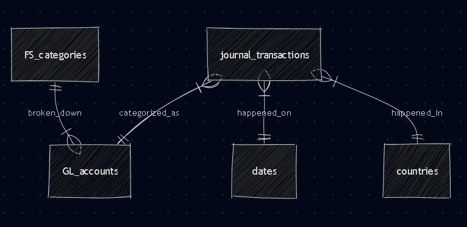

# Design Document

By Niña Shayne Clarette Torres

Video overview: [<URL HERE>](https://youtu.be/QORMxxIQXVU)

## Scope

Finance and accounting is ruled by financial transactions - revenues, expenses, and additions and reductions to assets, liabilities, and equity. In order to aid company decisions, financial analysis is essential. This requires financial data to be accurate and organized as much as possible which is the reason for the creation of this database. The financial database hopes to provide a database design that is comprehensive and succinct, to organize financial data and transactions.

This database includes journal transactions, general ledger (GL) accounts, financial reports' categories and how they relate to usual table connections like date and country. The database will also produce 2 financial statement reports - income statement and balance sheet.

To keep things simple, the database will only include basic GL accounts (usually with IDs starting from 1 to 5) and will not go into complex accounting such as other comprehensive income and the like. In addition, other relevant data such as payables, receivables, asset depreciation and capital expenditures will not be tackled. As database structure is the purpose of this project, the database will not have write features such as deletions and insertions.

## Functional Requirements

In this financial database, a user should be able to do the following:
* Search for transactions using dates, journal memos, categories, country
* View annual income statement and balance sheet
* Calculate common financial ratios like asset to deb ratio

The following is beyond the scope of the database:
* Cash flows and shareholder's equity reports which are part of the main financial statements but are excluded for purposes of simplicity
* Deleting and inserting transactions
* Relevant financial data other than indicated in the scope

## Representation

### Entities

The entities of this financial database include journal_transactions, GL_accounts, FS_categories, dates, countries, LOB.
The following are the attributes of each entity:
* journal_transactions (id INT PK, memo TEXT NOT NULL, amount NUMERIC CHECK(amount<>0), GL_id INT, date_id INT, country_id INT)
* GL_accounts (id INT PK, journal_id INT, GL_L1 TEXT NOT NULL, GL_L2 TEXT NOT NULL, GL_L3 TEXT)
* FS_categories (id INT PK, GL_id INT NOT NULL, type TEXT CHECK(type IN (income statement, balance sheet)))
* dates (id INT PK, date DATE NUMERIC NOT NULL, year INT NOT NULL, month INT NOT NULL, day INT NOT NULL)
* countries (id INT PK, journal_id INT NOT NULL, country NOT NULL)

The types chosen are above are based on the normal types each column has - for IDs, integers are used, amounts are in numeric format to retain the decimals, date is also in numeric as sqlite offers it for dates, while strings such as descriptions are in text types. An unusual method is addding a separate date table, however creating a data table that breaks it down into month, year, and day will make analysis of financial reports easier.

A few contraints are also included - journal amounts should not be equal to 0 as there should always be an amount added or deducted in a transaction. FS_categories column can also only have the "income statement" or "balance sheet" inputs.

### Relationships

The entity relationship diagram is embedded in the link below:

The following tables are included in the database:
* journal_transactions - daily financial transactions
* GL_accounts - general ledger accounts, contains the GL codes/accounts mapping of transactions; this summarizes the journal transactions into GL accounts
* FS_categories - mapping for financial statement items
* dates - contains a separate date with year, month, and day columns for easy filtering; connects to the journal dates
* countries - contains the countries where transactions occurred

## Optimizations

As usual queries are more focused in checking transactions and report views, the database was optimised with the following indexes:
* "journal_transactions"."GL_id"
* "journal_transactions"."date_id"
* "journal_transactions"."country_id"
* "dates"."year" and "dates"."month"
* "countries"."country"

The views included are the following:
* income statement
* balance sheet

The above were chosen due to its necessity in financial reporting.

## Limitations

The database is focused on the database structure of financial data and does not take into account inserting and deleting data. This is the main limitation that might might be added in future iterations. Moreover, as mentioned previously, financial data is not contrained to the tables created in this database. It connects to vast amounts of tabls and data, including line of businneses, payables and receivables, as well as inventory and planning, human resources and payroll, and capital expenditures and asset depreciation and amortization. Since financial data is the root of profit-centered companies, it is integrated in all facets of companies and more analysis can be done using these data which are out of scope for this project. This database only serves as a starting point and guide for the structure and design of a financial database schema.

